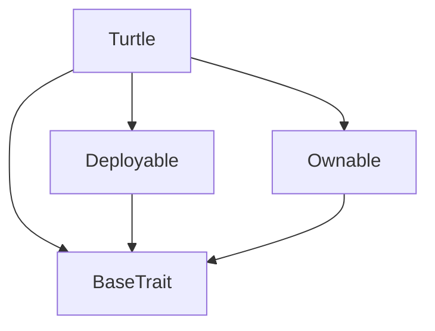
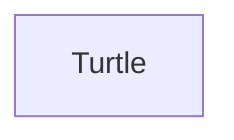

# TACT Compilation Report
Contract: Turtle
BOC Size: 2681 bytes

# Types
Total Types: 19

## StateInit
TLB: `_ code:^cell data:^cell = StateInit`
Signature: `StateInit{code:^cell,data:^cell}`

## StdAddress
TLB: `_ workchain:int8 address:uint256 = StdAddress`
Signature: `StdAddress{workchain:int8,address:uint256}`

## VarAddress
TLB: `_ workchain:int32 address:^slice = VarAddress`
Signature: `VarAddress{workchain:int32,address:^slice}`

## Context
TLB: `_ bounced:bool sender:address value:int257 raw:^slice = Context`
Signature: `Context{bounced:bool,sender:address,value:int257,raw:^slice}`

## SendParameters
TLB: `_ bounce:bool to:address value:int257 mode:int257 body:Maybe ^cell code:Maybe ^cell data:Maybe ^cell = SendParameters`
Signature: `SendParameters{bounce:bool,to:address,value:int257,mode:int257,body:Maybe ^cell,code:Maybe ^cell,data:Maybe ^cell}`

## Deploy
TLB: `deploy#946a98b6 queryId:uint64 = Deploy`
Signature: `Deploy{queryId:uint64}`

## DeployOk
TLB: `deploy_ok#aff90f57 queryId:uint64 = DeployOk`
Signature: `DeployOk{queryId:uint64}`

## FactoryDeploy
TLB: `factory_deploy#6d0ff13b queryId:uint64 cashback:address = FactoryDeploy`
Signature: `FactoryDeploy{queryId:uint64,cashback:address}`

## Status
TLB: `_ winner:int257 totalMe:int257 total:int257 winnerRate:int257 fee:int257 pnl:int257 total1:int257 me1:int257 total2:int257 me2:int257 total3:int257 me3:int257 total4:int257 me4:int257 total5:int257 me5:int257 total6:int257 me6:int257 total7:int257 me7:int257 total8:int257 me8:int257 total9:int257 me9:int257 total10:int257 me10:int257 = Status`
Signature: `Status{winner:int257,totalMe:int257,total:int257,winnerRate:int257,fee:int257,pnl:int257,total1:int257,me1:int257,total2:int257,me2:int257,total3:int257,me3:int257,total4:int257,me4:int257,total5:int257,me5:int257,total6:int257,me6:int257,total7:int257,me7:int257,total8:int257,me8:int257,total9:int257,me9:int257,total10:int257,me10:int257}`

## CBet
TLB: `c_bet#b83a622c turtleNumber:uint32 = CBet`
Signature: `CBet{turtleNumber:uint32}`

## Bet
TLB: `bet#a2753ed4 turtleNumber:uint32 address:address = Bet`
Signature: `Bet{turtleNumber:uint32,address:address}`

## History
TLB: `history#7b6653c9 number:uint32 total:int257 data:dict<address, int> = History`
Signature: `History{number:uint32,total:int257,data:dict<address, int>}`

## CPnl
TLB: `c_pnl#0600703f id:int257 = CPnl`
Signature: `CPnl{id:int257}`

## Pnl
TLB: `pnl#2317a174 id:int257 address:address = Pnl`
Signature: `Pnl{id:int257,address:address}`

## Withdraw
TLB: `withdraw#1bc3cf3b id:int257 = Withdraw`
Signature: `Withdraw{id:int257}`

## All
TLB: `all#4cf7d1d9 amount:int257 = All`
Signature: `All{amount:int257}`

## ChangeOwner
TLB: `change_owner#819dbe99 queryId:uint64 newOwner:address = ChangeOwner`
Signature: `ChangeOwner{queryId:uint64,newOwner:address}`

## ChangeOwnerOk
TLB: `change_owner_ok#327b2b4a queryId:uint64 newOwner:address = ChangeOwnerOk`
Signature: `ChangeOwnerOk{queryId:uint64,newOwner:address}`

## Turtle$Data
TLB: `null`
Signature: `null`

# Get Methods
Total Get Methods: 4

## total

## data
Argument: key

## id

## owner

# Error Codes
2: Stack underflow
3: Stack overflow
4: Integer overflow
5: Integer out of expected range
6: Invalid opcode
7: Type check error
8: Cell overflow
9: Cell underflow
10: Dictionary error
11: 'Unknown' error
12: Fatal error
13: Out of gas error
14: Virtualization error
32: Action list is invalid
33: Action list is too long
34: Action is invalid or not supported
35: Invalid source address in outbound message
36: Invalid destination address in outbound message
37: Not enough TON
38: Not enough extra-currencies
39: Outbound message does not fit into a cell after rewriting
40: Cannot process a message
41: Library reference is null
42: Library change action error
43: Exceeded maximum number of cells in the library or the maximum depth of the Merkle tree
50: Account state size exceeded limits
128: Null reference exception
129: Invalid serialization prefix
130: Invalid incoming message
131: Constraints error
132: Access denied
133: Contract stopped
134: Invalid argument
135: Code of a contract was not found
136: Invalid address
137: Masterchain support is not enabled for this contract
18136: not finished

# Trait Inheritance Diagram

# Contract Dependency Diagram

